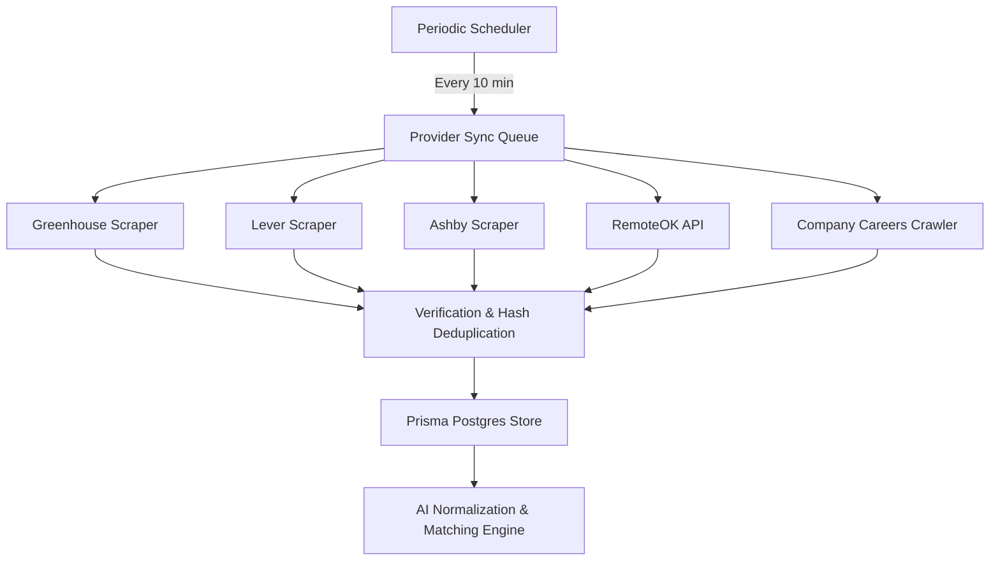

# Job Providers Integration Guide

This document describes the job discovery provider architecture of ApplyOS. It outlines authentication requirements, endpoints, rate limits, and synchronization details for each supported integration.

---

## Architecture Overview

ApplyOS implements a decoupled, asynchronous job discovery pipeline. Instead of triggering AI calls during the crawling phase, discovery pulls raw data from provider endpoints, verifies the URL's HTTP status, normalizes data structures, and registers them to the database.

---

## Supported Providers

### 1. Greenhouse
* **Integration Strategy**: Crawls public JSON boards API (`https://boards-api.greenhouse.io/v1/boards/{company}/jobs`).
* **Authentication**: Optional API Key for Harvest endpoints (`https://api.greenhouse.io/v1/offices`). Checked with Basic Auth.
* **Rate Limits**: Harvest API: 1500 requests per 10 seconds. Public Boards API: None.
* **Sync Behavior**: Gathers title, company, locations, description, and direct application URL.

### 2. Lever
* **Integration Strategy**: Pulls public Mode JSON postings (`https://api.lever.co/v0/postings/{company}?mode=json`).
* **Authentication**: Optional Lever API Key. Verified via `https://api.lever.co/v1/postings` basic auth header.
* **Rate Limits**: API Key: 10 requests per second. Public Postings: Unrestricted.

### 3. Ashby
* **Integration Strategy**: Crawls and parses public job board indices (`https://jobs.ashbyhq.com/{company}`).
* **Authentication**: Optional Ashby API Key. Validated via GET on `https://api.ashbyhq.com/v1/publishing/jobs`.
* **Rate Limits**: 200 requests/minute.

### 4. RemoteOK
* **Integration Strategy**: Queries the RemoteOK JSON API (`https://remoteok.com/api`) using target search query tags.
* **Authentication**: Connectionless (None).
* **Sync Behavior**: Direct ingestion of remote-only postings.

### 5. Company Careers Crawler
* **Integration Strategy**: Aggregates live listings directly from the verified Greenhouse, Lever, and Ashby boards of high-profile companies.
* **Tracked Entities**:
  * Vercel, OpenAI, Figma, Supabase, Retool (Greenhouse)
  * Stripe, Datadog (Lever)
  * Linear, Perplexity, Clerk, Resend (Ashby)
* **Authentication**: Connectionless (None).

---

## Sync Schedule & Verification

* **Frequency**: Triggered automatically every 10 minutes by the scheduler worker.
* **Deduplication**: Job listings are hashed using a SHA-256 fingerprint generated from:
  `lowercase(company_name) + lowercase(job_title) + lowercase(location)`
* **Active Status Checker**: Every 10 minutes, existing active database jobs are verified. Any job returning HTTP 404/Redirect or where the title no longer exists on the original URL is set to `isClosed = true`, `isLive = false` and moved to archived status.
